# SCARA Robot — Technical Documentation

## 1. Introduction

The SCARA (Selective Compliance Assembly Robot Arm) robot is designed for high-performance pick-and-place, assembly, and controlled automation tasks. This documentation details:
- Hardware overview
- Teach pendant user-interface
- Modbus-based communication (PC or PLC to robot)
- Real hardware, UI, and wiring images

---

## 2. Hardware & System Layout

### 2.1 Robot Main View
The physical Betrun SCARA robot in operational setup:
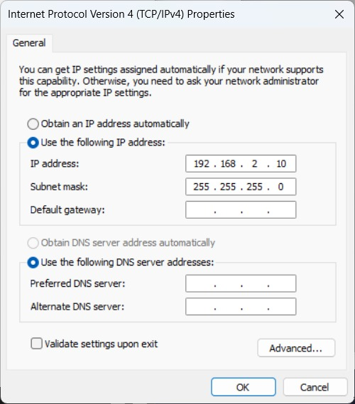

### 2.2 Control Panel & Wiring
Neat wiring and control cabinet for safe, reliable connections:
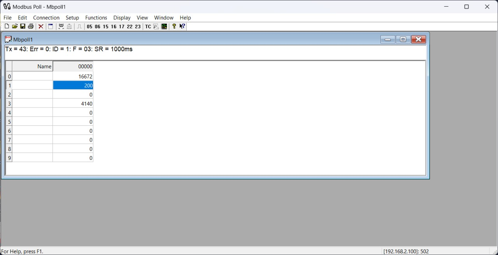

### 2.3 Detailed Wiring
Labelling and structured wiring for troubleshooting and maintenance:
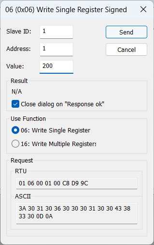

---

## 3. Teach Pendant User Interface

### 3.1 Device Overview
Handheld teach pendant for manual and programmatic control, featuring E-Stop, axis jog, and display:
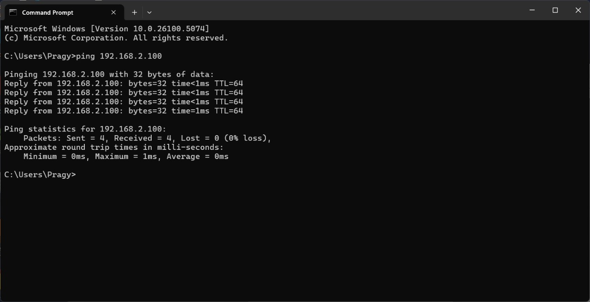

### 3.2 Home Screen
Shows project, user status, current robot mode (AUTO, TEACH), and quick menus.
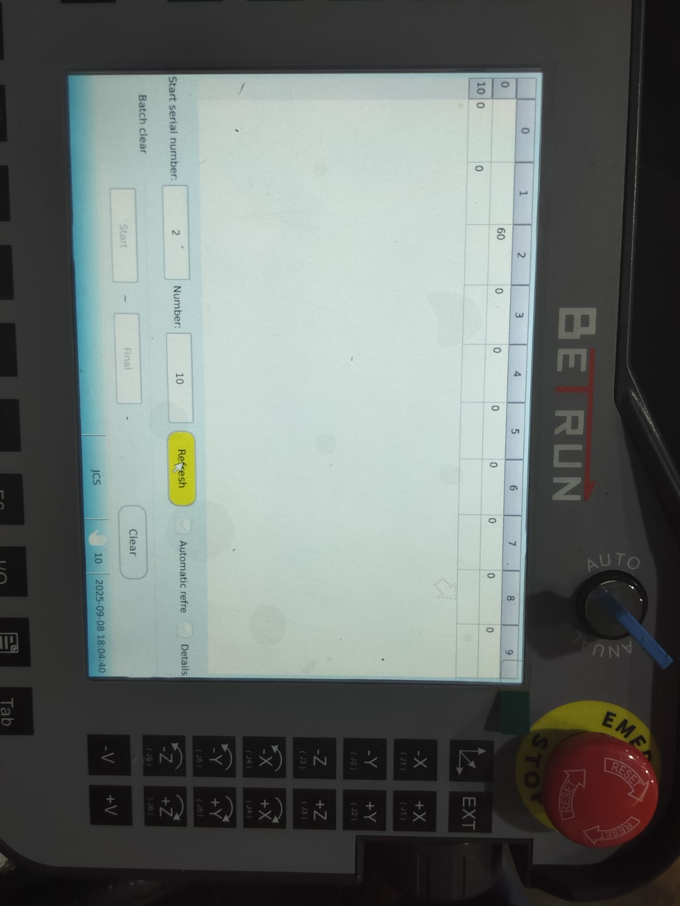

### 3.3 Editing & Running Programs
Motion routines are created, edited, and run from this tab:
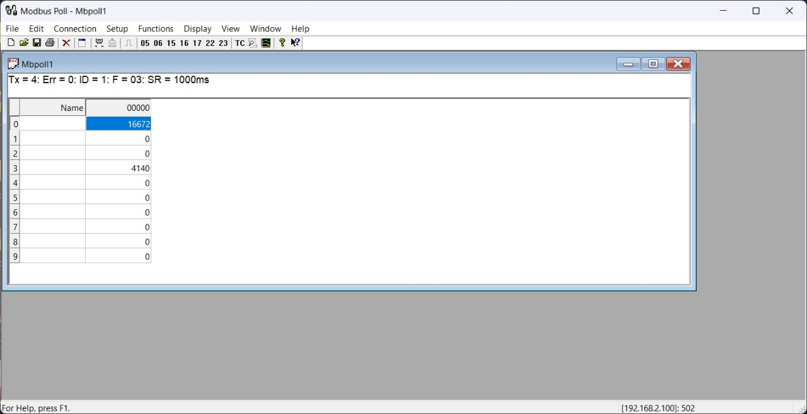

### 3.4 Teaching Points & Coordinates
Jog the robot, teach/save positions, and review pose data:

### 3.5 Jog Mode
Manual movement using pendant keys for each robot axis; step, continuous, world, and joint frame options:
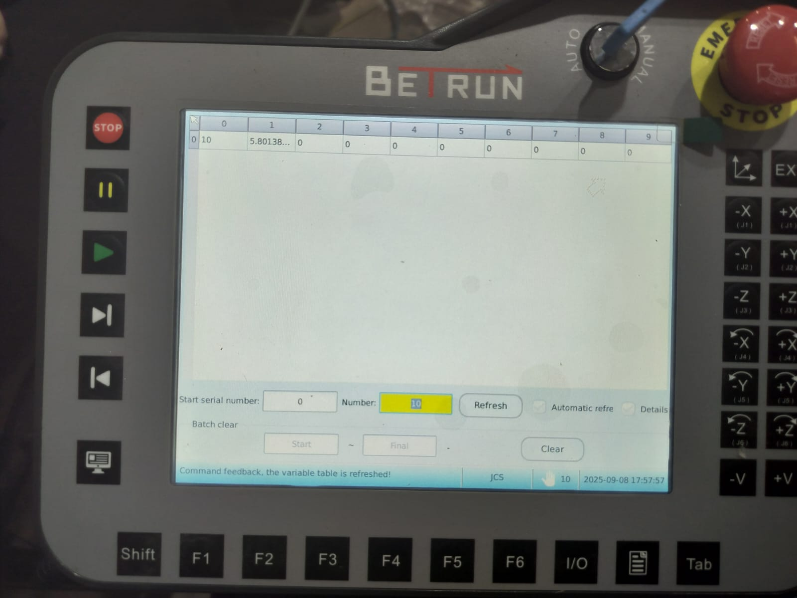

### 3.6 I/O Monitoring
Live display of digital and analog inputs/outputs for quick testing and troubleshooting:
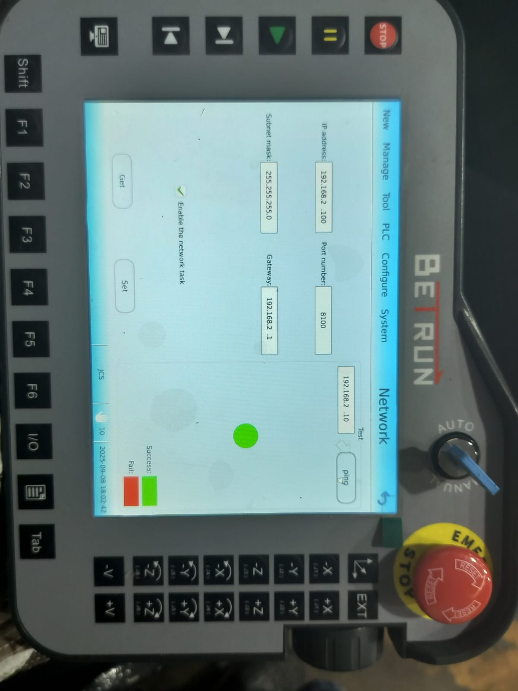

### 3.7 Alarms & System Info
See system errors, firmware version, and take safety actions:
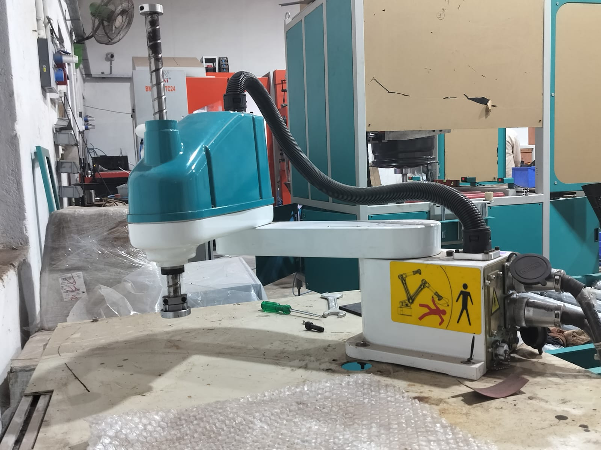

### 3.8 User Login & Permissions
Restrict access, control program editing, and protect the system:
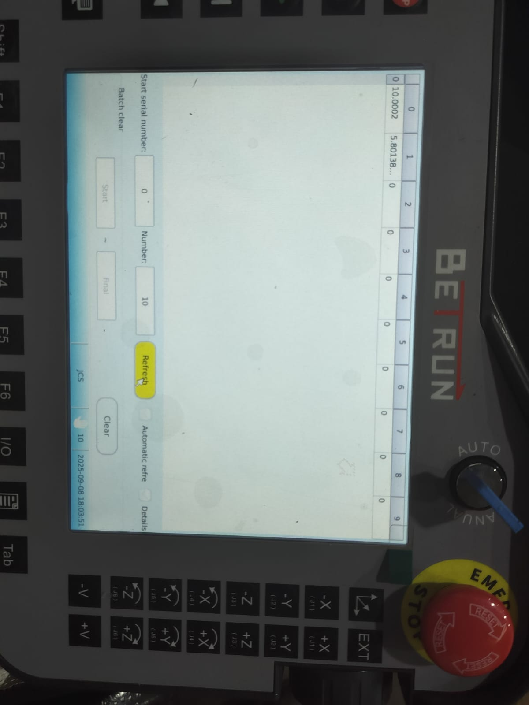

---

## 4. Modbus Communication System

### 4.1 System Block Diagram
Overview of PC/PLC master, Modbus RTU/TCP link, and robot controller integration:
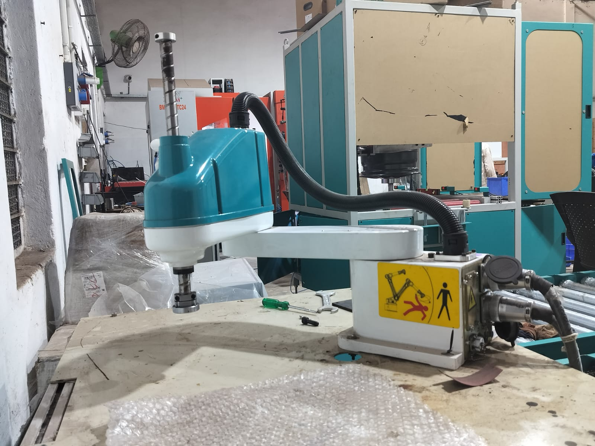

### 4.2 Pendant UI ↔ Modbus Register Mapping
How user actions update Modbus registers (e.g., program start, jog updates, alarm feedback):
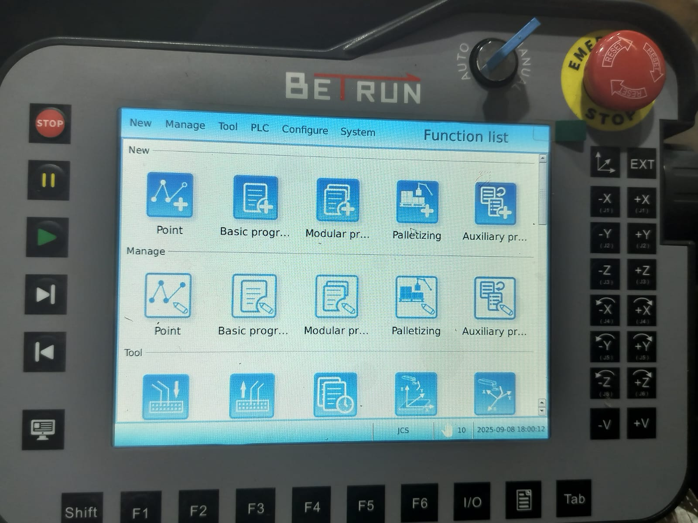

#### Modbus Setup Highlights
- Slave address & protocol config (RTU or TCP/IP)
- Register mapping (SRAM, DRAM)
- Match data types for reliability (int, float, bool)
- Typical flow: Write “Start” → robot executes → update status/alarm → master reads/monitors

---

## 5. Project Highlights

- **Direct hands-on programming** with teach pendant (jog, point, run, alarm handling)
- **Industrial wiring and safety** (photos included)
- **Turnkey Modbus integration:** Easy connection with PLC or PC for automation
- **Stepwise UI screens**: All main pendant functions shown
- **Error/status feedback** for robust real-world operation

---

